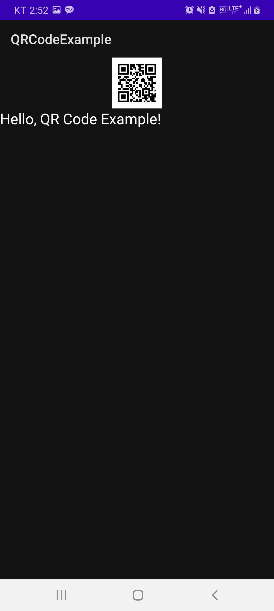
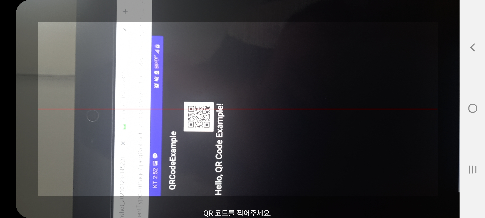

QR코드 생성 및 스캔 안드로이드 앱
=============  
QR코드 생성 및 스캔 안드로이드 앱입니다. 구현하기 위해 아래의 라이브러리를 사용했습니다.  
* ZXing (Zebra Crossing)  
* ML Kit  (Machine Learning Kit)  

# 실행화면 및 코드  
* 메인화면  

  
* ZXing을 이용한 QR코드 생성

  

  
* zxing-android-embedded를 이용한 QR코드 인식 (카메라 사용)  

  

  
* ML Kit를 이용한 QR코드 인식 (카메라 사용)  

  

  
* ZXing과 ML Kit를 이용한 QR코드 인식 (갤러리 이미지)   

  

  

# License
* Licensed under the [Apache License 2.0][1]

[1]: http://www.apache.org/licenses/LICENSE-2.0
